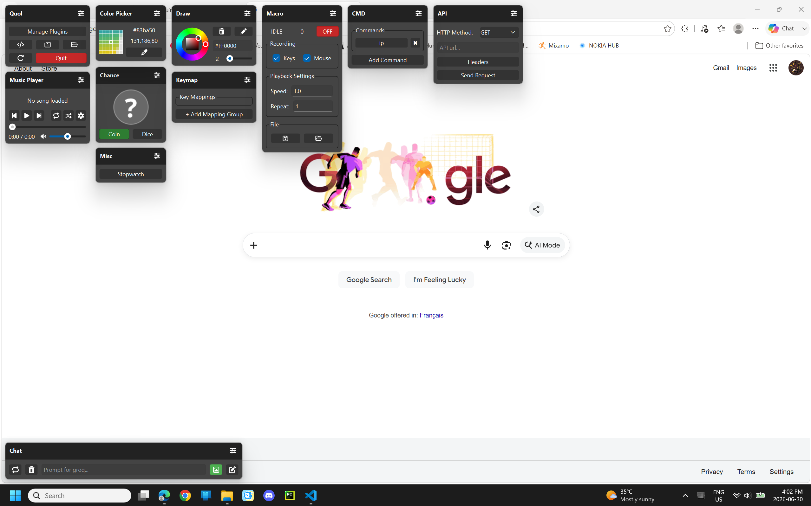

# Quol Tools

This repository hosts the zip files (plugins/tools) for the [Quol](https://github.com/LeoCh01/Quol) application.

## **Tools Overview**

**Anime**  
A tool to display the most recently aired anime.

**API**  
A tool to make HTTP requests (mini Postman).

**Clipboard**  
A tool to access clipboard history and create sticky notes.

**Color Picker**  
A tool to grab colors from the screen (RGB/HEX).

**Chance**  
A tool to roll a die; flip a coin.

**Chat**  
A tool to chat with an AI assistant on screen (Gemini, Groq, Ollama).

**CMD**  
A tool to manage and execute custom CMD commands.

**Draw**  
A tool to sketch on the screen. Includes color-picking, brush size adjustment, and an eraser.

**Keymap**  
A tool to create custom key mappings.

**Macros**  
A tool to record and play back mouse and keyboard actions.

**Stopwatch**  
A tool to measure elapsed time

---
