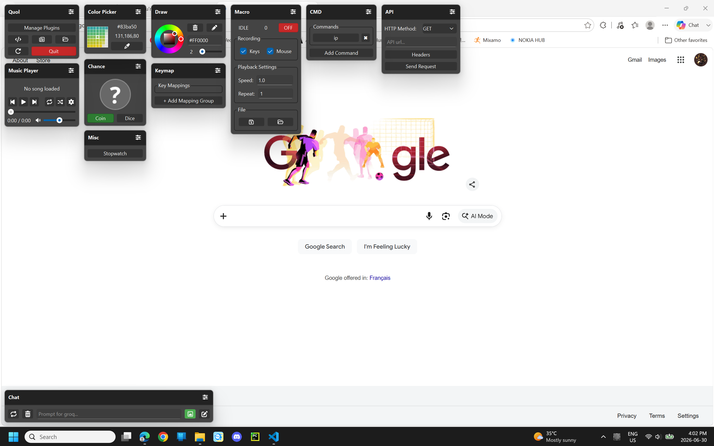

# Quol Tools

This repository hosts the zip files (plugins/tools) for the [Quol](https://github.com/LeoCh01/Quol) application.



## **Tools Overview**

**API**  
A tool to make HTTP requests (mini Postman).

**Color Picker**  
A tool to grab colors from the screen (RGB/HEX).

**Chat**  
A tool to chat with an AI assistant on screen (+ OCR text extraction).

**CMD**  
A tool to manage and execute custom CMD commands.

**Draw**  
A tool to sketch on the screen. Includes color-picking, brush size adjustment, and an eraser.

**Keymap**  
A tool to create custom key mappings.

**Macros**  
A tool to record and play back mouse and keyboard actions.

**Misc**  
A tool to manage other custom-windowed tools:

- Stopwatch
- Dice Roll
- Shader

**Music Player**  
A tool to play music.

## Plugin ZIP layout

A plugin is distributed as a `.zip` file named `<name>--v<version>.zip` (e.g. `example--v3.zip`).

```
<name>--v<version>.zip
├── <name>.dll                 # compiled C++ plugin DLL
├── res/
│   ├── config.json            # required — metadata and settings
│   └── ...                    # any other resource files
```

### `res/config.json`

Must contain a `"_"` section with plugin metadata:

```json
{
  "_": {
    "name": "Example",
    "version": 1,
    "description": "Example Quol plugin",
    "default_geometry": [400, 400, 280, 0]
  }
}
```

The root of the zip is extracted into `plugins/<name>/` at runtime. The DLL filename must match the plugin folder name (without extension).
